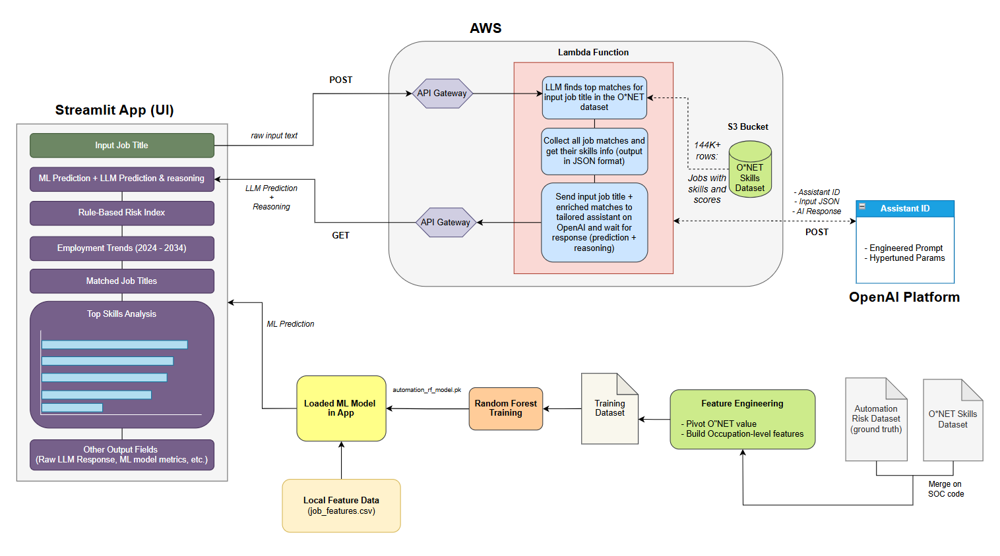

# ai-job-automation-risk-predictor
AI-powered system that predicts job automation risk by combining machine learning, LLM reasoning, and AWS-based workflow automation. Built with Random Forest, OpenAI, and AWS, it explains each role’s exposure to AI disruption.

## Live Demo

**Live App Link:** [Open the app here](https://job-automation-risk-predictor.streamlit.app/) 

## Project Overview

Job Automation Insights is an interactive Streamlit application that explores how exposed different occupations may be to automation. The goal of the project is to provide a more structured and interpretable view of automation risk by combining multiple approaches instead of relying on a single estimate.

The app compares a trained machine learning prediction, a standalone LLM-based estimate, and a simple rule-based baseline built from selected O*NET job traits. It also shows projected U.S. employment trends from 2024 to 2034 for the matched occupation.



## What the App Shows

When a user enters a job title, the app returns:

- **ML Automation Probability**: a machine learning prediction based on occupation-level features
- **LLM Automation Estimate**: a standalone estimate generated by a language model
- **Rule-Based Risk Index**: a simple manually built baseline score from selected O*NET job traits
- **U.S. Employment Outlook (2024–2034)**: projected employment counts and growth trends
- **Career Takeaway**: a short summary that combines the different signals
- **Skills Snapshot**: a visual and tabular summary of top skill groups for the matched occupation

## How the App Works

The project uses a hybrid pipeline.

First, the user enters a job title. The backend matches that title to the closest official occupation. Then the app combines three views of automation risk.

The first is a trained machine learning model. A Random Forest regressor was trained on occupation-level features built from O*NET-style data and an external automation-probability dataset. This is the main learned prediction shown in the app.

The second is an LLM-only estimate. This is a standalone language-model judgment that gives an additional perspective on the same occupation.

The third is a rule-based baseline. This is not a learned model, but a simple score built by manually selecting a small set of O*NET job traits that seemed more or less automatable and combining them into a structured index.

The app also displays projected employment outlook from 2024 to 2034, along with a combined summary to help interpret the results.

## Data and Modeling Pipeline

The project was built using two main data sources.

The first was an O*NET-based occupation dataset used for feature engineering. This dataset included occupation titles, employment projections, skill groups, O*NET element names, and data values. It was transformed into one row per occupation with structured feature columns.

The second was an external automation dataset used as the target for supervised learning. This provided automation-probability values by occupation. The two datasets were merged first by SOC code and then by occupation title when needed.

After merging, a Random Forest model was trained to predict automation probability from the engineered occupation-level features. In parallel, a rule-based score was built from manually selected feature groups to provide a simple baseline.

## Repository Structure

```text
ai-job-automation-risk-predictor/
├── app/
│   └── streamlit_app.py
├── src/
│   ├── clients/
│   │   └── aws_client.py
│   ├── aws/
│   │   └── lambda_handler.py
│   ├── llm/
│   │   ├── prediction_prompt.py
│   │   └── prompt_templates.py
│   ├── modeling/
│   │   ├── model_training.py
│   │   └── predict_model.py
│   └── preprocessing/
│       ├── feature_engineering.py
│       ├── merge_training_data.py
│       └── scoring.py
├── data/
├── notebooks/
├── models/
├── outputs/
└── docs/
```

## Main Components

## Main Components

- `app/streamlit_app.py` contains the Streamlit frontend used to enter job titles, call the AWS API, and display automation-risk results.
- `src/clients/aws_client.py` handles requests from the Streamlit app to the deployed AWS API Gateway endpoint.
- `src/aws/lambda_handler.py` contains the AWS Lambda backend logic used to process API requests, match job titles, retrieve job data, and return structured results.
- `src/llm/prediction_prompt.py` defines the prompt logic used for LLM-based job-title matching and reasoning.
- `src/llm/prompt_templates.py` stores reusable prompt templates for LLM calls.
- `src/preprocessing/feature_engineering.py` creates occupation-level features from raw job-skill data.
- `src/preprocessing/merge_training_data.py` merges engineered occupation features with automation-risk target data.
- `src/preprocessing/scoring.py` builds the rule-based automation-risk baseline from selected job traits.
- `src/modeling/model_training.py` trains and evaluates the Random Forest automation-risk model.
- `src/modeling/predict_model.py` runs local model inference using the trained model and processed occupation features.
- `models/automation_rf_model.pkl` stores the trained Random Forest model used by the local prediction pipeline.
- `data/raw/` contains original input datasets.
- `data/processed/` contains cleaned and engineered datasets used by the model and app.
- `outputs/` stores generated model outputs, predictions, and evaluation artifacts.
- `docs/` contains project documentation, including the system design diagram.


## Interpretation Notes

The three outputs in the app should not be treated as identical quantities.

The **ML Automation Probability** is the main learned prediction.  
The **LLM Automation Estimate** is a standalone language-model judgment.  
The **Rule-Based Risk Index** is a manually designed baseline, not a trained predictor.

Employment outlook and automation risk are related, but they are not the same thing. A job can still have strong future demand even if some of its tasks become more automated.

## Notes

This project is built on **U.S. occupation data and employment projections**.

## Future Work

Possible next steps include adding side-by-side occupation comparison, improving model interpretability, and exploring additional external benchmarks for validation.
